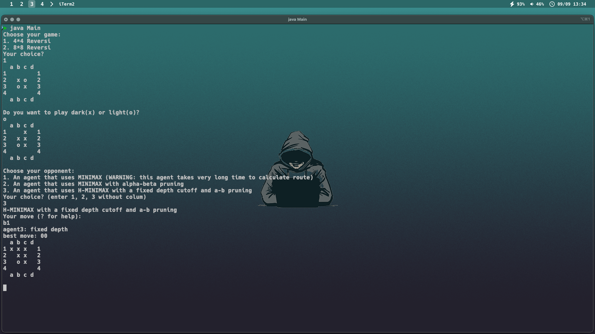

# Reversi AI Agent

This project is a Reversi (Othello) AI agent implemented in Java. The AI uses the Mini-Max algorithm with Alpha-Beta pruning to make optimal moves within the game. The entire implementation is less than 1000 lines of code.

## Introduction

Reversi, also known as Othello, is a strategy board game played on an 8x8 grid. The objective of the game is to have the majority of your colored discs on the board at the end of the game. Each player takes turns placing discs on the board, and any of the opponent's discs that are trapped between the newly placed disc and an existing disc of the player's color are flipped to the player's color.

### Basic Rules

1. **Initial Setup:** The board starts with four discs in the center: two white and two black. Each player controls one color (black or white).
2. **Turns:** Players take turns placing their discs on the board.
3. **Valid Moves:** A move is valid if it captures at least one of the opponent's discs. Discs are captured by sandwiching them between the newly placed disc and another disc of the player's color in a straight line (horizontal, vertical, or diagonal).
4. **End of the Game:** The game ends when neither player can make a valid move, or the board is full. The player with the most discs of their color at the end of the game wins.

## Features

- **Mini-Max Algorithm:** The AI determines the best possible move by simulating future game states and selecting the optimal path.
- **Alpha-Beta Pruning:** To optimize the Mini-Max search, Alpha-Beta pruning is implemented, reducing the number of nodes that need to be evaluated.
- **Command-Line Interface:** Play the game via the terminal.

## How the Game is Played

1. **Start the Game:**
   - Upon running the application, you will be prompted to choose the board size (4x4 or 8x8).
   - Select your piece color (dark or light).

2. **Choose Your Opponent:**
   - You can play against different AI strategies:
     - **MiniMax:** Basic AI using the Mini-Max algorithm.
     - **MiniMax with Alpha-Beta Pruning:** Optimized AI that uses Alpha-Beta pruning to reduce search space.
     - **H-MiniMax with Fixed Depth and Alpha-Beta Pruning:** A variant of MiniMax with a fixed depth and Alpha-Beta pruning.

3. **Gameplay:**
   - Enter your move as a column and row (e.g., "a1" for the top-left corner). If you have no legal moves, you can enter "pass."
   - The AI will then make its move based on the chosen strategy.
   - The game continues until neither player can make a move or the board is full.

4. **Ending the Game:**
   - Type "quit" to end the game and display the final score.

## Getting Started

### Prerequisites

- Java Development Kit (JDK) 8 or later.

### Running the Application

1. **Compile the Code:**

   ``` 
   javac Main.java
   java Main
   ```

Below is an example of how the game looks during gameplay:


